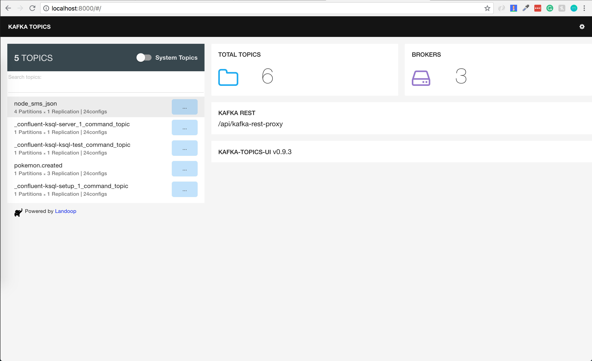

## Kafka Topics UI



---
### Usage

```
$ kubectl port-forward -n kafka <kafka-topics-ui-pod> 8000
```

Navigate to ```localhost:8000```

From this GUI, you are able to view all of the topics in your Kafka cluster. You are able to dig inside of your topics to view individual messages. If your topics stick to a specific format (which is good practice), you will be able to see the data in nice format as well as see the format type in the GUI.
