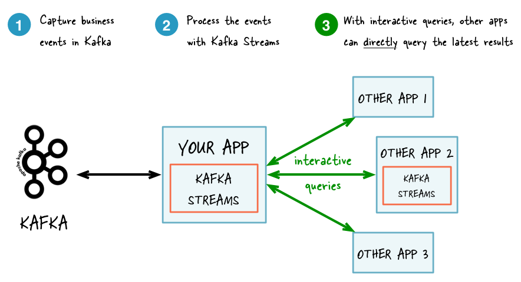

## KSQL (Production setup)

---

### About KSQL

KSQL is a DSL created by Confluent to abstract away parts of Kafka Streams, moving the streaming application of Kafka out of the JVM. This particularly useful for architectures built without the usage of the JVM.

|  | 
|:--:| 
| *Traditional Kafka Streams Architecture on the JVM* |

With KSQL you are able to create ```streams``` and ```tables```. ```Streams``` and ```tables``` are abstractions over vanilla Kafka topics. A ```stream``` is an unbounded sequence of events, or it can be thought of as a never-ending change log. Creating a ```stream``` gives you the ability to manipulate data in real-time as it enters Kafka. If you have millions of messages entering Kafka at once, KSQL can use a ```stream``` to minimize the compute power needed to transform the data by executing on a single message at a time rather than an entire data-set. A ```stream``` also gives you the ability to replay your your events. See this [Confluent article](https://www.confluent.io/blog/data-reprocessing-with-kafka-streams-resetting-a-streams-application/). A ```table``` represents the state of your messages at a given time. A ```table``` is comparable to a [compacted log](https://kafka.apache.org/documentation/#compaction) where only the most up-to-date version of a message is retained.

|  | 
|:--:| 
| *A KSQL Cluster with the JVM encapsulated* |
### Usage.

In a production setup of KSQL, it is recommended to deploy without a CLI. The command line interface gives developers a lot of freedom to possibly ruin pivotal queries. Instead of using the CLI to run your queries, you will use the configmap in this folder to save your queries. KSQL will automatically pull changes from this configmap when applied. You should test to make sure your queries work with the ```ksql-dev``` deployment and commit your changes to the configmap only when you are sure that your queries can run in production.

So to add a query to configmap, simply append your query to the end of the configmap in the context of the ```queries.sql``` section:

```yaml
data:
  queries.sql: |-
    -- KSQL queries go here
```

After ```apply```ing the deployment and your configmap (or only the configmap if you are updating an existing queries.sql). Your queries should be running.

To see an example of create KSQL queries, read the README in ```ksql-dev```

### Transforming between value formats

KSQL has the ability to transform data between formats such as JSON, Avro, and delimited. This can be useful for ETL purposes, or things like maintaining two formats of your Kafka messages for new and legacy applications to consume.

In the following example we will be transforming Avro data to JSON data with KSQL.

Assume our schema looks something like this:

```json{.line-numbers}
{
    "namespace": "com.company.examples",
    "type": "record"
    "name": "Users",
    "fields": [
        { "name": "firstname", "type": "string", "doc": "The first name of a user in our app." },
        { "name": "username", "type": "string", "doc": "The username of a user in our app." },
    ],
    "doc": "A schema to represent a user in our application"
}
```

Let's say we have sent a few messages to a Kafka topic called ```users.created```, and these messages use the Avro schema from above. 

> For this transformation to work, at least one message must be inside the topic we want to transform if we are starting from an Avro value format.

To transform from Avro to JSON we need to create a ```stream``` over our base topic ```users.created```

> The following command should be ran from the KSQL CLI

```sql
create stream "users_created" ("firstname" varchar, "username" varchar) with (kafka_topic='users.created', value_format='AVRO');
...
--------------
STREAM CREATED
--------------
```

Notice how we specified the column names for our stream. This seems unnecessary considering we used a typed schema to create our message in the first place. If we were to omit, the column definition in our command, the type **would** be correctly inferred, but the names of our columns would be capitalized rather than lowercase.

Now that we have a base stream to create other streams from, we can run this command.

```sql
create stream "users.created.json" with (value_format='JSON') as select * from "users_created";
...
----------------------------
STREAM CREATED AND EXECUTING
---------------------------- 
``` 

Note the executing portion of our success message from the CLI which is different than our previous command's output message. Because of ```as select * from "users_created"```, this stream is created as a persistent query against the stream```users_craeted```, and any data that enters the stream will be saved to the topic ```users.created.json```. Now as Avro messages enter the topic ```users.created``` they will flow into the stream ```users_created```. From ```users_created``` messages will be transformed into JSON via the ```users.created.json``` stream and placed into the ```users.created.json``` topic on the Kafka cluster.

> Note: a non-executing stream will not create a new topic on the Kafka cluster, so our first command will not create a topic called users_created.